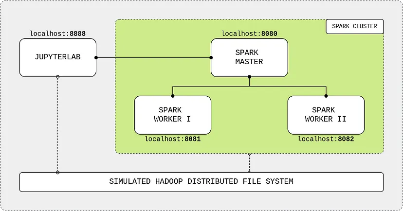

# Creación de un clúster spark con docker

En este documento se explicará el proceso de creación de un clúster spark con docker, se añadirá un nodo de acceso prográmatico mediante python, con la herramienta jupyterlab

Basándonos en la estructurá proporcionada por André Perez en su [artículo](https://towardsdatascience.com/apache-spark-cluster-on-docker-ft-a-juyterlab-interface-418383c95445), nuestra estructura se compone de:  en nuestro caso crearemos un volumén de tipo bind, para poder acceder a los datos en una carpeta relativa a la ubicación del archivo yaml, posterior, necesitamos de esas características para el desarrollo posterior de nuestra aplicación, el sistema de archivos que simula un HDFS, sigue de la misma manera, así como la estructura interna del clúster spark (2 nodos workers, 1 nodo maestro), para mas información visitar el [artículo](https://towardsdatascience.com/apache-spark-cluster-on-docker-ft-a-juyterlab-interface-418383c95445) de referencia.

## Imagen base

Esta imagen será la inicial en ella se basarán el resto, esta a su vez esta basada en una imagen que contiene la implementación de linux debian como sistema operativo y la instalación de openjdk (java), necesitado posteriormente para que funcione spark.

```dockerfile 
ARG debian_buster_image_tag=8-jre-slim
FROM openjdk:${debian_buster_image_tag}

# -- Layer: OS + Python 3.7

ARG shared_workspace=/opt/workspace

RUN mkdir -p ${shared_workspace} && \
    apt-get update -y && \
    apt-get install -y python3 && \
    ln -s /usr/bin/python3 /usr/bin/python && \
    rm -rf /var/lib/apt/lists/*

ENV SHARED_WORKSPACE=${shared_workspace}

# -- Runtime

CMD ["bash"]
```

### Imagen base spark

Sobre esta se construirán las dos imágenes spark restantes, la master y la worker, en esta se instala una versión de spark compatible con spark hadoop para el sistema de archivos diseñado, además se definen variables de entorno necesitadas posteriormente.

```dockerfile
FROM cluster-base

# -- Layer: Apache Spark

ARG spark_version=3.4.0
ARG hadoop_version=3

RUN apt-get update -y && \
    apt-get install -y curl && \
    curl https://archive.apache.org/dist/spark/spark-${spark_version}/spark-${spark_version}-bin-hadoop${hadoop_version}.tgz -o spark.tgz && \
    tar -xf spark.tgz && \
    mv spark-${spark_version}-bin-hadoop${hadoop_version} /usr/bin/ && \
    mkdir /usr/bin/spark-${spark_version}-bin-hadoop${hadoop_version}/logs && \
    rm spark.tgz

ENV SPARK_HOME /usr/bin/spark-${spark_version}-bin-hadoop${hadoop_version}
ENV SPARK_MASTER_HOST spark-master
ENV SPARK_MASTER_PORT 7077
ENV PYSPARK_PYTHON python3

# -- Runtime

WORKDIR ${SPARK_HOME}
```

#### Master node

Se ejecuta el archivo de deployment de spark como nodo maestro y se expone el puerto por el que se comunicará con los otros nodos spark y el puerto de interfaz web usada para verificar el estado del nodo.

```dockerfile
FROM spark-base

# -- Runtime

ARG spark_master_web_ui=8080

EXPOSE ${spark_master_web_ui} ${SPARK_MASTER_PORT}
CMD bin/spark-class org.apache.spark.deploy.master.Master >> logs/spark-master.out
```

#### Worker node

Se ejecuta el archivo de deployment de spark como nodo worker y se expone el puerto de interfaz web usada para verificar el estado del nodo.

```dockerfile
FROM spark-base

# -- Runtime

ARG spark_worker_web_ui=8081

EXPOSE ${spark_worker_web_ui}
CMD bin/spark-class org.apache.spark.deploy.worker.Worker spark://${SPARK_MASTER_HOST}:${SPARK_MASTER_PORT} >> logs/spark-worker.out
```

### Imagen jupyterlab

Se instala pip en primera instancia, posteriormente mediante este se instala jupyter, pyspark y más dependencias necesitadas para la ejecución de la práctica, se expone el puerto con el que accederemos al notebook y se ejecuta jupyterlab.

```dockerfile
FROM cluster-base

# -- Layer: JupyterLab

ARG spark_version=3.4.0
ARG jupyterlab_version=3.6.3

RUN apt-get update -y && \
    apt-get install -y python3-pip && \
    pip3 install wget pyspark==${spark_version} jupyterlab==${jupyterlab_version} pymongo pandas numpy neo4j semanticscholar

# -- Runtime

EXPOSE 8888
WORKDIR ${SHARED_WORKSPACE}

CMD jupyter lab --ip=0.0.0.0 --port=8888 --no-browser --allow-root --NotebookApp.token='' --NotebookApp.password=''
```

## Creación de las imagenes

Una vez que contamos con los dockerfiles, ejecutamos secuencialmente las siguientes instrucciones en la consola de comandos.

**Imagen base**

```bash
docker build -t cluster-base -f <nombre_archivo>.Dockerfile .
```

**Imagen Spark-base**

```bash
docker build --build-arg spark_version="<SPARK_VERSION>" --build-arg hadoop_version="<HADOOP_VERSION>" -f <nombre_archivo>.Dockerfile -t spark-base .
```

**Imagen Spark-master**

```bash
docker build -f <nombre_archivo>.Dockerfile -t spark-master .
```

**Imagen Spark-worker**

```bash
docker build -f <nombre_archivo>.Dockerfile -t spark-worker .
```

**Imagen jupyterlab**

```bash
docker build --build-arg spark_version="<SPARK_VERSION>" --build-arg jupyterlab_version="<JUPYTERLAB_VERSION>" -f <nombre_archivo>.Dockerfile -t jupyterlab .
```

En nuestro caso se han usado las versiones:

SPARK_VERSION="3.4.0"
HADOOP_VERSION="3"
JUPYTERLAB_VERSION="3.6.3"

## Creación del clúster

Por último una vez creado el clúster se pondrá en marcha mediante el uso de docker-compose, a través de este se crearán los volúmenes pertinentes.

```yaml
version: "3.6"
services:
  jupyterlab:
    image: jupyterlab
    container_name: jupyterlab
    ports:
      - 8888:8888
    volumes:
      - ./hdfs:/opt/workspace
  spark-master:
    image: spark-master
    container_name: spark-master
    ports:
      - 8080:8080
      - 7077:7077
    volumes:
      - ./hdfs:/opt/workspace
  spark-worker-1:
    image: spark-worker
    container_name: spark-worker-1
    environment:
      - SPARK_WORKER_CORES=1
      - SPARK_WORKER_MEMORY=512m
    ports:
      - 8081:8081
    volumes:
      - ./hdfs:/opt/workspace
    depends_on:
      - spark-master
  spark-worker-2:
    image: spark-worker
    container_name: spark-worker-2
    environment:
      - SPARK_WORKER_CORES=1
      - SPARK_WORKER_MEMORY=512m
    ports:
      - 8082:8081
    volumes:
      - ./hdfs:/opt/workspace
    depends_on:
      - spark-master
```

De esta manera, el clúster quedaría inciado, a continuación se listarán los puertos usados y sus funciones:

* 8888: conexión con jupyterlab.
* 8080: estado del nodo maestro.
* 8081: estado del worker1.
* 8082: estado del worker2.
* 7077: conexión interna nodos spark

### Pruebas de funcionamiento

Para probar su funcionamiento crearemos un notebook, ya sea externamente en la carpeta ./hdfs, o mediante la interfaz web de jupyterlab, a la que nos conectaremos mediante la dirección [localhost:8888](http://localhost:8888/), el notebook deberá contener un código como este.

```py
#Importamos la libreria pyspark
from pyspark.sql import SparkSession

#Creamos una sesión, conectandonos al master
spark = SparkSession.\
        builder.\
        appName("ejemplo").\
        master("spark://spark-master:7077").\
        config("spark.executor.memory", "512m").\
        getOrCreate()

#Cargamos un fichero txt, de ejemplo
text_file = spark.read.text("data/ejemplo.txt")

#Ejecutamos un simple word count
counts = text_file.rdd.flatMap(lambda line: line.value.split()) \
             .map(lambda word: (word, 1)) \
             .reduceByKey(lambda a, b: a + b)

#Guardamos los resultados
counts.saveAsTextFile("data/output")

#Detenemos la sesión para liberar a los nodos
spark.stop()
```

Un ejemplo de texto puede ser:

*The quick brown fox jumped over the lazy dog. The lazy dog slept in the shade of the tree. The quick brown fox returned to see the lazy dog napping in the sun.*

Se creará después de ejecutar el código una carpeta llamada output, dentro habrá un archivo llamado de manera similar a (part-00000), dentro el resultado tendrá que ser:

('The', 3)
('quick', 2)
('brown', 2)
('fox', 2)
('jumped', 1)
('over', 1)
('the', 5)
('lazy', 3)
('dog.', 1)
('dog', 2)
('slept', 1)
('in', 2)
('shade', 1)
('of', 1)
('tree.', 1)
('returned', 1)
('to', 1)
('see', 1)
('napping', 1)
('sun.', 1)

Si es así el clúster funciona correctamente.
